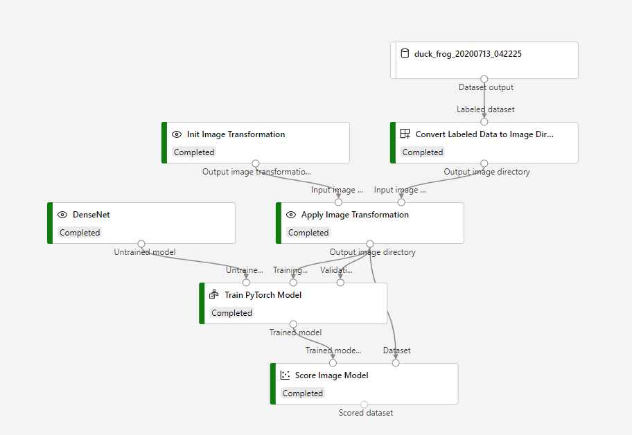

Convert Labeled Data to Image Directory Module
=========================================
This is a sample to demonstrate a custom module which converts labeled dataset to image directory to make output dataset of 'Data Labeling' available in pipeline.

Pipeline graph
-----------------------------

Dataset
-----------------------------
This is a labeled dataset generated with "Data Labeling".

Results
-----------------------------
See logs in [this pipeline run](https://ml.azure.com/experiments/id/e4f1516b-54b6-499b-8e7d-ba371d7a4b3f/runs/842d247f-56ae-4e56-b1d2-fb98c3eb6bac?wsid=/subscriptions/e9b2ec51-5c94-4fa8-809a-dc1e695e4896/resourcegroups/thy-experiment/workspaces/heta-EUS&tid=72f988bf-86f1-41af-91ab-2d7cd011db47).
