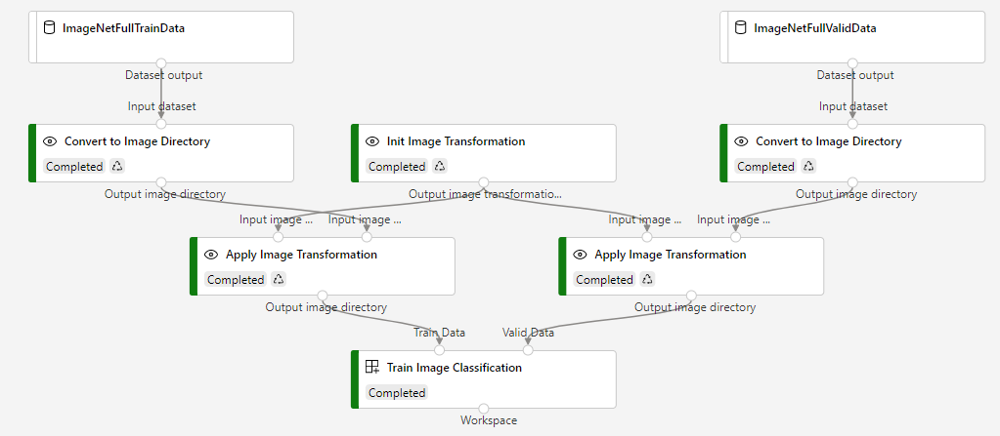

Image classification distributed training pipeline on ITP compute
=========================================
This is a sample to demonstrate distributed training in azure machine learning. In this pipeline, we use designer built-in modules to do image preprocessing on cpu nodes, and a mpi custom module on distributed gpu nodes.

Pipeline graph
-----------------------------

Dataset
-----------------------------
This is the full official imagenet dataset, saved in \\pengwa01\shares\training\autoresize\imagenet\2012

- training dataset contains 1.2m images (1000 categories * 1200 images per category)
- validation dataset contains 50k images (1000 categories * 50 images per category)

Need to use zip file here to avoid perf issue in mounting file dataset with many sub-folders.

Results
-----------------------------
See logs in [this pipeline run](https://ml.azure.com/experiments/id/b67b7e5e-f825-48e2-b879-530c06e0f047/runs/17f6ded8-6210-4b0f-8f1e-d1286cafe04d?wsid=/subscriptions/4aaa645c-5ae2-4ae9-a17a-84b9023bc56a/resourcegroups/itp-pilot-ResGrp/workspaces/itp-pilot&tid=72f988bf-86f1-41af-91ab-2d7cd011db47).
